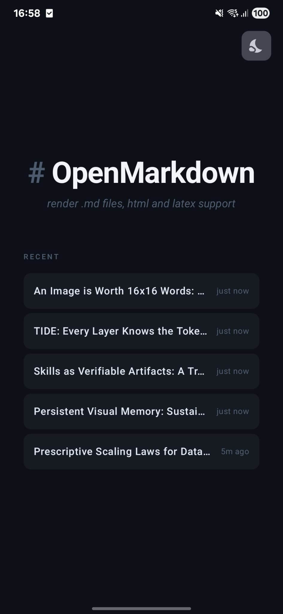

# OpenMarkdown

Android markdown viewer with HTML and LaTeX (KaTeX) rendering.

  

Render `.md` files from any file manager or app that sends `text/markdown` or `text/plain`. WebView-based rendering with markdown-it 14 + KaTeX, table of contents navigation and simple sharing.

More screenshots available in [`screenshots/`](screenshots/).

## Features

- Render `.md`, `.markdown` files via `ACTION_VIEW`, `ACTION_SEND`, or `ACTION_EDIT`.
- **LaTeX math** via KaTeX — inline `$...$` and display `$$...$$`.
- **HTML passthrough** — markdown-it runs in `html: true` mode.
- **Table of contents** — auto-detected from ATX (`#`–`######`) and setext headings. Modal bottom sheet with scroll tracking.
- **Recent files** — last 5 files cached locally.
- **Themes** — Light / Dark.
- **No network** — all rendering assets vendored locally.

## Requirements

- **Minimum**: Android 8.0 (API 26 — Oreo)
- **Target**: Android 16 (API 36)

## Architecture

See [docs/ARCH.md](docs/ARCH.md) for deep dive.