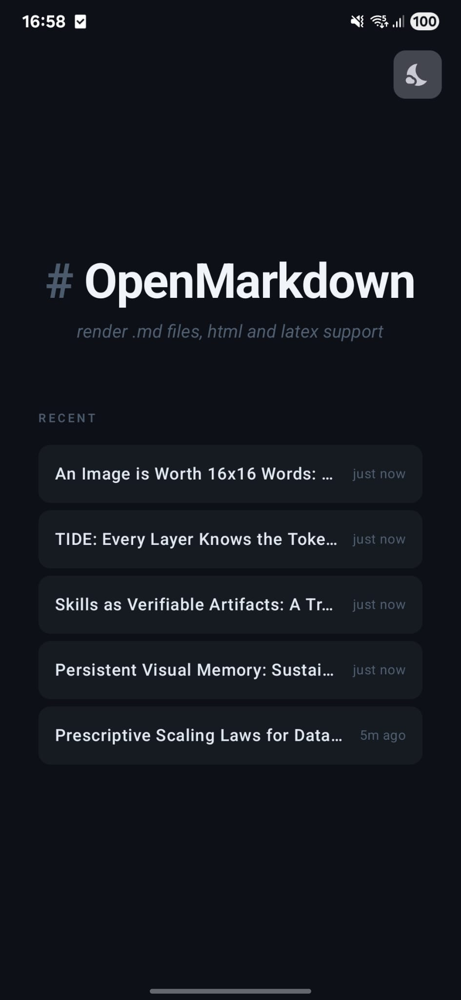

# OpenMarkdown

Android markdown viewer with HTML and LaTeX (KaTeX) rendering.

  

Render `.md` files from any file manager or app that sends `text/markdown` or `text/plain`. WebView-based rendering with markdown-it 14 + KaTeX, table of contents navigation and simple sharing.

More screenshots available in [`screenshots/`](screenshots/).

## Features

- Render `.md`, `.markdown` files via `ACTION_VIEW`, `ACTION_SEND`, or `ACTION_EDIT`.
- **LaTeX math** via KaTeX — inline `$...$` and display `$$...$$`.
- **HTML passthrough** — markdown-it runs in `html: true` mode.
- **Table of contents** — auto-detected from ATX (`#`–`######`) and setext headings. Modal bottom sheet with scroll tracking.
- **Recent files** — last 5 files cached locally.
- **Themes** — Light / Dark.
- **No network** — all rendering assets vendored locally.

## Requirements

- **Minimum**: Android 8.0 (API 26 — Oreo)
- **Target**: Android 16 (API 36)

## Build and install

Run `./debug.sh` or `./release.sh` to build, install, and launch on connected Android devices. The scripts discover USB and wireless devices, with emulators used when no authorized physical device is available. Wireless pairing requires an interactive terminal.

Add `--clear` only to erase app data on every selected device before installing. This removes recent file history, cached documents, and settings.

Release builds require these environment variables or Gradle properties (for example, in `~/.gradle/gradle.properties`):

- `OPENMD_RELEASE_KEYSTORE`: absolute path to your release keystore.
- `OPENMD_RELEASE_KEY_ALIAS`: signing key alias.
- `OPENMD_RELEASE_STORE_PASSWORD`: keystore password.
- `OPENMD_RELEASE_KEY_PASSWORD`: signing key password.

Keep signing credentials outside the repository. The release APK is saved as `app/build/outputs/apk/release/OpenMarkdown.apk`.

Debug and release use the same package, `com.mascit.openmarkdown`, but different signing keys. Switching between them requires manually uninstalling the existing app, which erases its data. The scripts do not uninstall automatically; `--clear` does not resolve a signing mismatch.

## Architecture

See [docs/ARCH.md](docs/ARCH.md) for deep dive.